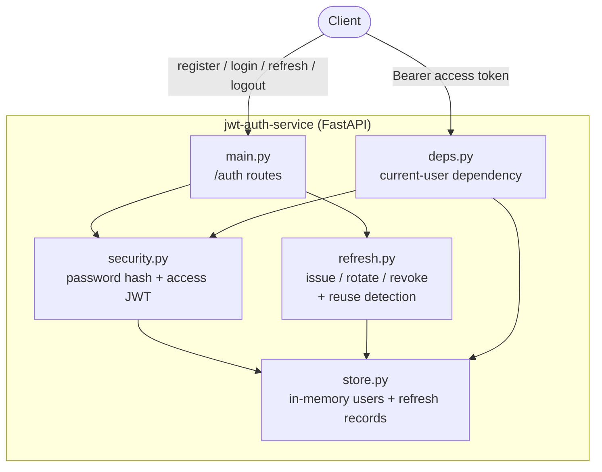

# JWT Auth Service

A small FastAPI authentication microservice with short-lived access tokens and rotating, hashed refresh tokens — including refresh-token reuse detection.


## Overview

`jwt-auth-service` is a self-contained demonstration of a modern token-based
authentication flow. Users register and log in with a username and password;
the service returns a **short-lived access token** (a signed JWT) and a
**long-lived refresh token**. The access token authorizes requests to
protected endpoints; the refresh token is exchanged for a new pair when the
access token expires.

Refresh tokens are **rotated** on every use and **stored only as hashes**. If a
previously rotated token is ever presented again — the tell-tale sign of a
stolen token — the service treats it as a breach and **revokes the entire token
family**, forcing re-authentication.

The stores are in-memory, so the whole thing runs with no database or external
services. That makes it a focused portfolio piece rather than a production
deployment (see [Security notes](#security-notes)).

## Architecture



## Endpoints

| Method | Path             | Auth              | Description                                                        |
| ------ | ---------------- | ----------------- | ------------------------------------------------------------------ |
| POST   | `/auth/register` | none              | Create a user.                                                     |
| POST   | `/auth/login`    | none              | Verify credentials; return an access + refresh token pair.         |
| POST   | `/auth/refresh`  | refresh token     | Rotate the refresh token and mint a new access token.              |
| POST   | `/auth/logout`   | refresh token     | Revoke a refresh token (idempotent).                               |
| GET    | `/auth/me`       | Bearer access JWT | Return the authenticated user.                                     |
| GET    | `/health`        | none              | Liveness probe.                                                    |

Interactive OpenAPI docs are served at `/docs` when the app is running.

## Features

- **Short-lived access tokens** — signed JWTs (HS256) carrying `sub`, `iss`,
  `iat`, `exp`, `jti`, and a `type` claim, with a 15-minute default lifetime.
- **Rotating refresh tokens** — each refresh call retires the presented token
  and issues a fresh successor within the same token *family*.
- **Reuse detection** — replaying an already-rotated refresh token is flagged
  as theft and revokes every token in that family.
- **Hashed at rest** — refresh tokens are opaque random strings; only their
  SHA-256 hashes are stored, so the store never holds a replayable secret.
- **Secure password hashing** — bcrypt via passlib (`$2b$` hashes).
- **Type-safe boundaries** — Pydantic request/response models and typed
  settings loaded from the environment.

## Tech stack

- **Python 3.11**
- **FastAPI** + **Uvicorn** (ASGI)
- **PyJWT** for access-token signing/verification
- **passlib[bcrypt]** for password hashing
- **Pydantic** / **pydantic-settings** for models and configuration
- **pytest** + Starlette **TestClient** for tests

## Getting started

```bash
# 1. Create and activate a virtual environment
python -m venv .venv
source .venv/bin/activate        # Windows: .venv\Scripts\activate

# 2. Install the project (with dev/test extras)
pip install -e ".[dev]"

# 3. Configure the environment
cp .env.example .env             # then edit JWT_SECRET

# 4. Run the service
uvicorn jwtauth.main:app --reload
```

The API is now available at `http://127.0.0.1:8000` (docs at `/docs`).

## Usage

A full walkthrough with `curl` (responses trimmed for readability):

```bash
BASE=http://127.0.0.1:8000

# Register a user
curl -s -X POST $BASE/auth/register \
  -H 'Content-Type: application/json' \
  -d '{"username":"alice","password":"s3cret-passw0rd"}'
# {"id":"0bb62aca...","username":"alice","created_at":"2026-08-04T17:22:24Z"}

# Log in -> access + refresh tokens
curl -s -X POST $BASE/auth/login \
  -H 'Content-Type: application/json' \
  -d '{"username":"alice","password":"s3cret-passw0rd"}'
# {"access_token":"<jwt>","refresh_token":"<opaque>",
#  "token_type":"bearer","expires_in":900}

# Call a protected endpoint with the access token
ACCESS=<paste access_token>
curl -s $BASE/auth/me -H "Authorization: Bearer $ACCESS"
# {"id":"0bb62aca...","username":"alice","created_at":"2026-08-04T17:22:24Z"}

# Rotate the refresh token (returns a NEW pair; the old refresh token dies)
REFRESH=<paste refresh_token>
curl -s -X POST $BASE/auth/refresh \
  -H 'Content-Type: application/json' \
  -d "{\"refresh_token\":\"$REFRESH\"}"
# {"access_token":"<new jwt>","refresh_token":"<new opaque>", ...}

# Reuse the OLD refresh token -> reuse detected, whole family revoked -> 401
curl -s -o /dev/null -w '%{http_code}\n' -X POST $BASE/auth/refresh \
  -H 'Content-Type: application/json' \
  -d "{\"refresh_token\":\"$REFRESH\"}"
# 401

# Log out (revoke a refresh token; idempotent)
curl -s -X POST $BASE/auth/logout \
  -H 'Content-Type: application/json' \
  -d "{\"refresh_token\":\"$REFRESH\"}"
# {"detail":"logged out"}
```

## Security notes

- **Demo store, swap for a real DB.** Users and refresh records live in process
  memory (`store.py`) and vanish on restart. For anything real, back the `Store`
  interface with a persistent database (PostgreSQL, Redis, etc.).
- **Set a strong `JWT_SECRET`.** The default in `config.py` is intentionally
  obvious and must be overridden via the environment in any deployment.
- **HMAC (HS256) is symmetric** — the signing secret verifies tokens too. For
  multi-service setups prefer asymmetric signing (RS256/EdDSA) so verifiers hold
  only the public key.
- **Serve over TLS.** Tokens are bearer credentials; never send them over plain
  HTTP.
- **Refresh tokens are hashed at rest**, but access-token *revocation* before
  expiry is not implemented — access tokens are trusted until they expire, which
  is why their lifetime is short. Add a denylist if you need instant revocation.
- No rate limiting or account lockout is included; add these at the edge
  (gateway / reverse proxy) for production.

## Project structure

```
jwt-auth-service/
├── jwtauth/
│   ├── __init__.py
│   ├── config.py        # settings loaded from the environment
│   ├── models.py        # Pydantic schemas + internal store records
│   ├── store.py         # in-memory users + refresh records
│   ├── security.py      # password hashing + access-JWT mint/verify
│   ├── refresh.py       # issue / rotate / revoke + reuse detection
│   ├── deps.py          # current-user dependency (Bearer auth)
│   └── main.py          # FastAPI app + /auth routes
├── tests/
│   └── test_auth.py     # end-to-end flow tests (pytest + TestClient)
├── .github/workflows/ci.yml
├── .env.example
├── pyproject.toml
├── requirements.txt
├── LICENSE
└── README.md
```

## Testing

```bash
pip install -e ".[dev]"
pytest
```

The suite covers the full lifecycle: register → login → access a protected
route; refresh rotation issuing a new token; reuse of a rotated token being
detected and revoking the family; wrong-password and unknown-user rejection;
logout revocation; and rejection of a refresh token presented as an access
token.

## Roadmap

- [ ] Persistent store implementation (PostgreSQL / Redis) behind the `Store` seam
- [ ] Asymmetric JWT signing (RS256 / EdDSA) with key rotation
- [ ] Access-token denylist for instant revocation
- [ ] Rate limiting and account lockout
- [ ] Email verification and password-reset flows
- [ ] Containerfile + docker-compose for local runs

## License

Released under the [MIT License](LICENSE). Copyright (c) 2026 Matthews Wong.

---

Part of my cloud & AI portfolio — see [github.com/matthews-wong](https://github.com/matthews-wong).
